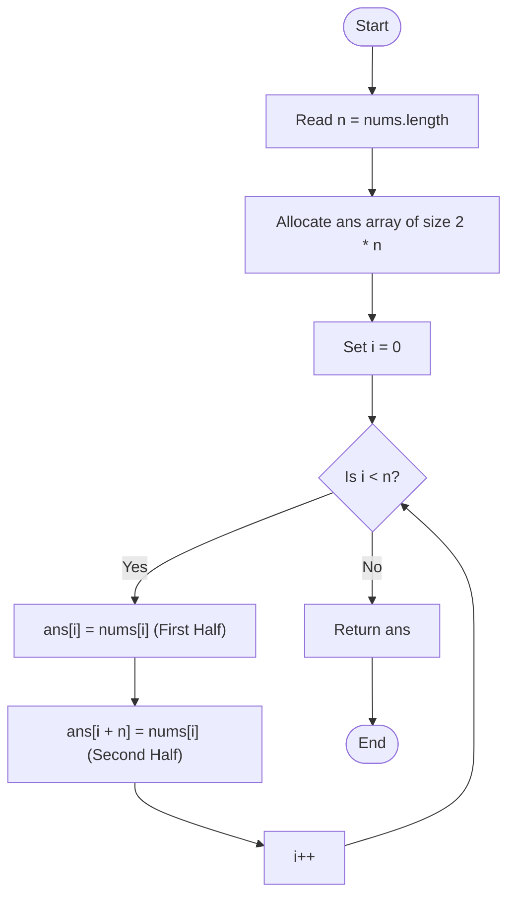

<h2><a href="https://leetcode.com/problems/concatenation-of-array">0000. Concatenation Of Array</a></h2>

<p>Given an integer array <code>nums</code> of length <code>n</code>, you want to create an array <code>ans</code> of length <code>2n</code> where <code>ans[i] == nums[i]</code> and <code>ans[i + n] == nums[i]</code> for <code>0 &lt;= i &lt; n</code> (<strong>0-indexed</strong>).</p>

<p>Specifically, <code>ans</code> is the <strong>concatenation</strong> of two <code>nums</code> arrays.</p>

<p>Return <em>the array </em><code>ans</code>.</p>

<p>&nbsp;</p>
<p><strong class="example">Example 1:</strong></p>

<pre><strong>Input:</strong> nums = [1,2,1]
<strong>Output:</strong> [1,2,1,1,2,1]
<strong>Explanation:</strong> The array ans is formed as follows:
- ans = [nums[0],nums[1],nums[2],nums[0],nums[1],nums[2]]
- ans = [1,2,1,1,2,1]</pre>

<p><strong class="example">Example 2:</strong></p>

<pre><strong>Input:</strong> nums = [1,3,2,1]
<strong>Output:</strong> [1,3,2,1,1,3,2,1]
<strong>Explanation:</strong> The array ans is formed as follows:
- ans = [nums[0],nums[1],nums[2],nums[3],nums[0],nums[1],nums[2],nums[3]]
- ans = [1,3,2,1,1,3,2,1]
</pre>

<p>&nbsp;</p>
<p><strong>Constraints:</strong></p>

<ul>
	<li><code>n == nums.length</code></li>
	<li><code>1 &lt;= n &lt;= 1000</code></li>
	<li><code>1 &lt;= nums[i] &lt;= 1000</code></li>
</ul>


---

# 🛍️ Concatenation-Of-Array | Explained

## Approach 1: Single-Pass Direct Mapping
### Intuition
Imagine you have a single strip of sticker stamps containing $n$ pictures, and you are tasked with creating a longer album page that displays that exact pattern twice back-to-back. Instead of peeling and placing all $n$ stamps for the first half and then starting from the beginning again to fill the second half, you can copy each stamp to both of its designated spots simultaneously. For every element at index `i` in the original array, its first duplicate belongs at index `i` in the target array, and its second duplicate belongs at index `i + n`.

### Algorithm Visualized


### Approach
1. **Determine Input Size**: Retrieve the length of the input array `nums` and store it in variable `n`.
2. **Allocate Target Array**: Instantiate a new integer array `ans` with size $2 \times n$ to store the duplicated sequence.
3. **Single Pass Duplication**: Iterate through the input array from index `i = 0` up to `n - 1`. During each iteration:
   - Copy `nums[i]` to `ans[i]` (filling the first half of the array).
   - Copy `nums[i]` to `ans[i + n]` (filling the second half of the array).
4. **Return Result**: Return the fully populated `ans` array.

### Detailed Code Analysis
- **Line 3 (`int n=nums.length;`)**: Caches the length of `nums` in a local primitive integer `n`. This avoids redundant length evaluations and provides the offset needed to compute the destination index for the second half.
- **Line 4 (`int [] ans=new int [2*n];`)**: Dynamically allocates heap memory for the output array `ans` with length $2n$. In Java, memory for this array is zero-initialized by default.
- **Lines 5–9 (`for(int i=0;i<n;i++) { ... }`)**: Executes a `for` loop exactly $n$ times.
  - **Line 7 (`ans[i]=nums[i];`)**: Writes the current value `nums[i]` directly to the corresponding index in the first block ($0$ to $n-1$) of `ans`.
  - **Line 8 (`ans[i+n]=nums[i];`)**: Applies an offset of $n$ to write the same value `nums[i]` into the corresponding index in the second block ($n$ to $2n-1$) of `ans`.
- **Line 10 (`return ans;`)**: Returns the reference to the newly constructed array containing the concatenated elements.

### Code
```java
class Solution {
    public int[] getConcatenation(int[] nums) {
        int n=nums.length;
        int [] ans=new int [2*n];
        for(int i=0;i<n;i++)
        {
            ans[i]=nums[i];
            ans[i+n]=nums[i];
        } 
        return ans;
    }
}
```

### Complexity
- **Time Complexity:** $\mathcal{O}(n)$ — The algorithm uses a single loop that runs exactly $n$ times. Inside the loop, array read and write operations take $\mathcal{O}(1)$ constant time, leading to an overall linear time complexity proportional to the length of `nums`.
- **Space Complexity:** $\mathcal{O}(1)$ auxiliary space — Excluding the space allocated for the output array `ans` (which is required by the problem statement to return $2n$ elements), no additional memory scales with input size $n$. If counting the output array, the space complexity is $\mathcal{O}(n)$.

## 🕵️‍♂️ Follow-up Questions (Optional)

### 1. How would you implement this using Java's built-in system memory operations, and what are the performance trade-offs?
You can use `System.arraycopy()` to perform bulk memory transfers twice:

```java
class Solution {
    public int[] getConcatenation(int[] nums) {
        int n = nums.length;
        int[] ans = new int[2 * n];
        System.arraycopy(nums, 0, ans, 0, n);
        System.arraycopy(nums, 0, ans, n, n);
        return ans;
    }
}
```
**Trade-off:** `System.arraycopy()` is a native method implemented in C++ (typically using optimized CPU instructions like `memcpy`). For large array sizes, native bulk copying performs faster than an explicit Java `for` loop because it reduces overhead and takes advantage of low-level memory vectorization.

### 2. How can you generalize this solution if the problem asks to concatenate the array $k$ times instead of twice?
You can use a nested loop or the modulo operator:

```java
class Solution {
    public int[] getKConcatenation(int[] nums, int k) {
        int n = nums.length;
        int[] ans = new int[k * n];
        for (int i = 0; i < k * n; i++) {
            ans[i] = nums[i % n];
        }
        return ans;
    }
}
```
Alternatively, using `System.arraycopy` inside a loop running $k$ times avoids the performance cost of the modulo operation (`%`).