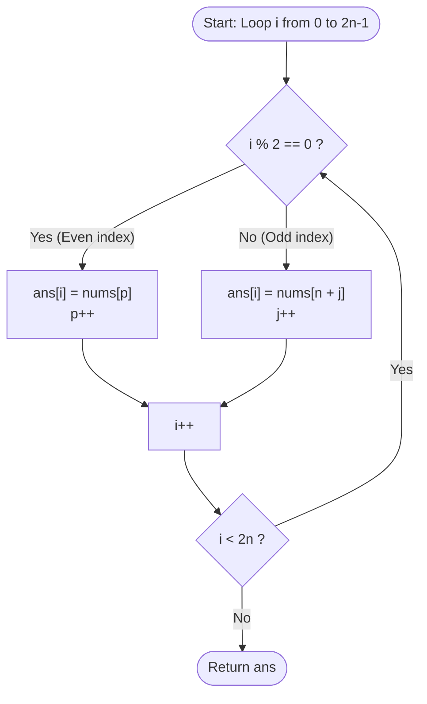

<h2><a href="https://leetcode.com/problems/shuffle-the-array">0000. Shuffle The Array</a></h2>

<p>Given the array <code>nums</code> consisting of <code>2n</code> elements in the form <code>[x<sub>1</sub>,x<sub>2</sub>,...,x<sub>n</sub>,y<sub>1</sub>,y<sub>2</sub>,...,y<sub>n</sub>]</code>.</p>

<p><em>Return the array in the form</em> <code>[x<sub>1</sub>,y<sub>1</sub>,x<sub>2</sub>,y<sub>2</sub>,...,x<sub>n</sub>,y<sub>n</sub>]</code>.</p>

<p>&nbsp;</p>
<p><strong class="example">Example 1:</strong></p>

<pre><strong>Input:</strong> nums = [2,5,1,3,4,7], n = 3
<strong>Output:</strong> [2,3,5,4,1,7] 
<strong>Explanation:</strong> Since x<sub>1</sub>=2, x<sub>2</sub>=5, x<sub>3</sub>=1, y<sub>1</sub>=3, y<sub>2</sub>=4, y<sub>3</sub>=7 then the answer is [2,3,5,4,1,7].
</pre>

<p><strong class="example">Example 2:</strong></p>

<pre><strong>Input:</strong> nums = [1,2,3,4,4,3,2,1], n = 4
<strong>Output:</strong> [1,4,2,3,3,2,4,1]
</pre>

<p><strong class="example">Example 3:</strong></p>

<pre><strong>Input:</strong> nums = [1,1,2,2], n = 2
<strong>Output:</strong> [1,2,1,2]
</pre>

<p>&nbsp;</p>
<p><strong>Constraints:</strong></p>

<ul>
	<li><code>1 &lt;= n &lt;= 500</code></li>
	<li><code>nums.length == 2n</code></li>
	<li><code>1 &lt;= nums[i] &lt;= 10^3</code></li>
</ul>

---

# 🛍️ Shuffle-The-Array | Explained

## Approach 1: Two-Pointer Alternating Placement with Modulo Indexing
### Intuition
Imagine a deck of $2n$ cards split cleanly into two halves: the left half (cards $x_1, x_2, \dots, x_n$) and the right half (cards $y_1, y_2, \dots, y_n$). We want to interleave them like a perfect riffle shuffle: $[x_1, y_1, x_2, y_2, \dots, x_n, y_n]$.

To achieve this, we can maintain two separate pointers/cursors—one pointing to the current position in the first half ($x$) and another pointing to the current position in the second half ($y$). As we fill a new destination array from index $0$ to $2n-1$, we alternate: even indices take from the first half, and odd indices take from the second half.

### Algorithm Visualized


### Approach
1. **Initialize Output Array:** Allocate a new array `ans` of size $2n$ to hold the interleaved results.
2. **Initialize Pointers:** 
   - `p = 0` tracks the index of the $x$-elements (range $[0, n-1]$).
   - `j = 0` tracks the offset for the $y$-elements (actual index in `nums` is $n + j$, range $[n, 2n-1]$).
3. **Iterate and Interleave:** Run a single loop with index `i` from $0$ up to $2n - 1$:
   - If `i` is **even** (`i % 2 == 0`): Place `nums[p]` into `ans[i]`, then increment `p`.
   - If `i` is **odd** (`i % 2 != 0`): Place `nums[n + j]` into `ans[i]`, then increment `j`.
4. **Return:** Once the loop terminates, `ans` contains the fully interleaved array.

### Detailed Code Analysis
- **Line 3 (`int []ans=new int[2*n];`):** Allocates a fresh integer array of size $2n$. This is necessary because the problem requires returning an array containing all $2n$ rearranged elements.
- **Lines 4–5 (`int j=0; int p=0;`):** Initializes two independent read pointers:
  - `p` reads sequentially through the first half ($[0, n-1]$).
  - `j` represents the relative offset for the second half ($[n, 2n-1]$).
- **Line 6 (`for(int i=0;i<2*n;i++)`):** Loops across every target index in `ans` from $0$ to $2n - 1$.
- **Lines 8–12 (`if(i%2==0) { ans[i]=nums[p]; p++; }`):** Determines if the target index is even. If so, it takes the current $x$-value at index `p` and increments `p` for the next even slot.
- **Lines 13–17 (`else { ans[i]=nums[n+j]; j++; }`):** Handles odd target indices. It accesses the corresponding $y$-value at index `n + j` and increments `j` for the next odd slot.
- **Line 20 (`return ans;`):** Returns the populated result array.

### Code
```java
class Solution {
    public int[] shuffle(int[] nums, int n) {
        int[] ans = new int[2 * n];
        int j = 0;
        int p = 0;
        for (int i = 0; i < 2 * n; i++) {
            if (i % 2 == 0) {
                ans[i] = nums[p];
                p++;
            } else {
                ans[i] = nums[n + j];
                j++;
            }
        }
        return ans;
    }
}
```

### Complexity
- **Time:** $\mathcal{O}(n)$ — The loop executes exactly $2n$ iterations, doing constant $\mathcal{O}(1)$ operations (modulo, assignment, increments) in each iteration.
- **Space:** $\mathcal{O}(1)$ auxiliary space (or $\mathcal{O}(n)$ if considering the return array) — Aside from the required output array of size $2n$, only a few primitive variables (`i`, `j`, `p`) are allocated.

---

## 🕵️‍♂️ Follow-up Questions

1. **Can this be done in $\mathcal{O}(1)$ auxiliary space in-place?**
   - **Answer:** Yes, if the constraint on element values allows bit manipulation. Since $nums[i] \le 1000$ (which fits in 10 bits), and standard 32-bit integers have 32 bits, we can store two numbers in a single integer by bit-shifting: `nums[i] |= (nums[i + n] << 10)`. In a second pass, we extract and place the numbers into their proper positions.

2. **Can we simplify the loop to avoid the modulo check `i % 2 == 0`?**
   - **Answer:** Yes. Instead of iterating `i` from $0$ to $2n-1$ with conditional branches, we can loop `i` from $0$ to $n-1$ and fill two indices per iteration:
     ```java
     for (int i = 0; i < n; i++) {
         ans[2 * i] = nums[i];
         ans[2 * i + 1] = nums[i + n];
     }
     ```
     This eliminates branch prediction overhead and reduces pointer bookkeeping.