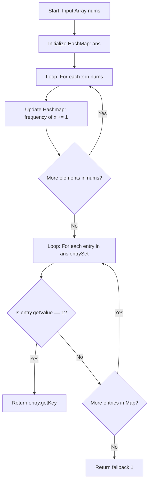

<h2><a href="https://leetcode.com/problems/single-number-ii">137. Single Number II</a></h2>

<p>Given an integer array <code>nums</code> where&nbsp;every element appears <strong>three times</strong> except for one, which appears <strong>exactly once</strong>. <em>Find the single element and return it</em>.</p>

<p>You must&nbsp;implement a solution with a linear runtime complexity and use&nbsp;only constant&nbsp;extra space.</p>

<p>&nbsp;</p>
<p><strong class="example">Example 1:</strong></p>
<pre><strong>Input:</strong> nums = [2,2,3,2]
<strong>Output:</strong> 3
</pre><p><strong class="example">Example 2:</strong></p>
<pre><strong>Input:</strong> nums = [0,1,0,1,0,1,99]
<strong>Output:</strong> 99
</pre>
<p>&nbsp;</p>
<p><strong>Constraints:</strong></p>

<ul>
	<li><code>1 &lt;= nums.length &lt;= 3 * 10<sup>4</sup></code></li>
	<li><code>-2<sup>31</sup> &lt;= nums[i] &lt;= 2<sup>31</sup> - 1</code></li>
	<li>Each element in <code>nums</code> appears exactly <strong>three times</strong> except for one element which appears <strong>once</strong>.</li>
</ul>


---

# 🛍️ Single-Number-II | Explained

## Approach 1: Frequency Counting using HashMap
### Intuition
Imagine you are an auditor inspecting a warehouse shipment. The manifest states that almost every distinct product arrives in identical bundles of three, except for one unique prototype that was sent alone. 

To identify the unique prototype, you take a tally board. As you unpack each item from the input array, you look up its item code on your tally board and increment its count. Once all items are logged, you scan your tally board from top to bottom. The item code associated with a tally count of exactly `1` is your single element.

### Algorithm Visualized


### Approach
1. **Frequency Tracking Setup**: Instantiate a `HashMap<Integer, Integer>` named `ans` where keys represent the numbers from the array and values represent their frequency of occurrence.
2. **Frequency Population Phase**: 
   - Iterate through the `nums` array using an enhanced `for` loop.
   - For each number `x`, update its count in the hash map using `ans.getOrDefault(x, 0) + 1`. This safely retrieves the current frequency (or `0` if unseen) and adds `1`.
3. **Lookup Phase**:
   - Iterate through the key-value pairs (`Map.Entry`) of the hash map using `ans.entrySet()`.
   - Check if any entry has a value equal to `1`.
   - The first key whose value is `1` is the single number, so return `entry.getKey()`.
4. **Fallback Return**:
   - Return a default integer (`1`) at the end of the method to satisfy Java's requirement for a return statement outside the loop logic.

### Detailed Code Analysis
- **Line 3**: `HashMap<Integer,Integer>ans =new HashMap<>();`
  - Instantiates a standard Java `HashMap`. The hash map maps every unique `Integer` key to an `Integer` count value.
- **Lines 4-7**: 
  ```java
  for(int x:nums)
  {
      ans.put(x,ans.getOrDefault(x,0)+1);
  }
  ```
  - Traverses every element `x` in the primitive array `nums`.
  - `ans.getOrDefault(x, 0)` eliminates the need for an explicit `containsKey` check, returning either the current count or `0` if `x` has not yet been added. `.put()` then writes back the incremented count.
- **Lines 8-14**:
  ```java
  for(Map.Entry<Integer,Integer>entry:ans.entrySet())
  {
      if(entry.getValue()==1)
      {
          return entry.getKey();
      }
  }
  ```
  - `ans.entrySet()` returns a set view of the mappings contained in the map. Iterating over `Map.Entry` objects is more efficient than iterating over `keySet()` and performing a secondary lookup (`ans.get(key)`).
  - `entry.getValue() == 1` tests if the frequency count of the current entry is `1`. When matched, `entry.getKey()` immediately returns the target single number.
- **Line 15**: `return 1;`
  - Serves as a placeholder return required by the Java compiler. Given the problem constraints (a single non-repeating number is guaranteed to exist), this statement is unreachable.

### Code
```java
class Solution {
    public int singleNumber(int[] nums) {
        HashMap<Integer,Integer>ans =new HashMap<>();
        for(int x:nums)
        {
            ans.put(x,ans.getOrDefault(x,0)+1);
        }
        for(Map.Entry<Integer,Integer>entry:ans.entrySet())
        {
            if(entry.getValue()==1)
            {
                return entry.getKey();
            }
        }
        return 1;
        
    }
}
```

### Complexity
- **Time:** $\mathcal{O}(N)$  
  - Populating the hash map takes $\mathcal{O}(N)$ time, as each insertion/lookup operation in a `HashMap` takes $\mathcal{O}(1)$ average time across $N$ elements.
  - Iterating over the map entries takes $\mathcal{O}(K)$ time, where $K = \frac{N - 1}{3} + 1$ is the number of unique elements. Since $K \le N$, this is $\mathcal{O}(N)$.
  - Total Time Complexity: $\mathcal{O}(N)$.

- **Space:** $\mathcal{O}(N)$  
  - The `HashMap` stores $K$ unique entries. In the worst/average case, $K \approx \frac{N}{3}$, requiring auxiliary space proportional to $N$.
  - Total Space Complexity: $\mathcal{O}(N)$.

---

## 🕵️‍♂️ Follow-up Questions

### 1. How can this problem be solved in $\mathcal{O}(1)$ extra space as requested by the original LeetCode constraint?
To achieve $\mathcal{O}(1)$ auxiliary space, you can use **Bit Manipulation**:
- **Bit Counting per Position**: Sum the bits at each of the 32 positions across all numbers. For any bit position, if a bit appears a multiple of 3 times, those set bits belong to numbers that repeat 3 times. The remainder modulo 3 (`sum % 3`) at each position gives the bit value for the single number.
- **Digital Logic (Bitwise State Machine)**: Maintain two variables, `ones` and `twos`, to track bits that have appeared 1 time or 2 times modulo 3.
  ```java
  int ones = 0, twos = 0;
  for (int x : nums) {
      ones = (ones ^ x) & ~twos;
      twos = (twos ^ x) & ~ones;
  }
  return ones;
  ```
  This reduces space complexity to $\mathcal{O}(1)$ while keeping time complexity at $\mathcal{O}(N)$.

### 2. Why does the Bit Manipulation (Bit Counting) approach work for negative numbers in Java?
Java uses 32-bit two's complement representation for signed integers (`int`). Because two's complement encodes negative numbers into a fixed 32-bit sequence, summing the bit counts at each position $i \in [0, 31]$ and modulo-ing by 3 preserves the sign bit (bit 31) along with all value bits, reconstructing the exact signed representation of the target number without requiring special branches for negative values.