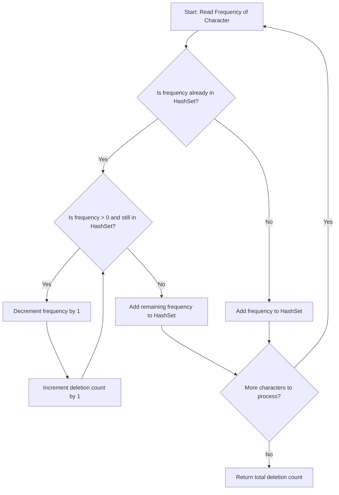

<h2><a href="https://leetcode.com/problems/minimum-deletions-to-make-character-frequencies-unique">1647. Minimum Deletions to Make Character Frequencies Unique</a></h2>

<p>A string <code>s</code> is called <strong>good</strong> if there are no two different characters in <code>s</code> that have the same <strong>frequency</strong>.</p>

<p>Given a string <code>s</code>, return<em> the <strong>minimum</strong> number of characters you need to delete to make </em><code>s</code><em> <strong>good</strong>.</em></p>

<p>The <strong>frequency</strong> of a character in a string is the number of times it appears in the string. For example, in the string <code>"aab"</code>, the <strong>frequency</strong> of <code>'a'</code> is <code>2</code>, while the <strong>frequency</strong> of <code>'b'</code> is <code>1</code>.</p>

<p>&nbsp;</p>
<p><strong class="example">Example 1:</strong></p>

<pre><strong>Input:</strong> s = "aab"
<strong>Output:</strong> 0
<strong>Explanation:</strong> <code>s</code> is already good.
</pre>

<p><strong class="example">Example 2:</strong></p>

<pre><strong>Input:</strong> s = "aaabbbcc"
<strong>Output:</strong> 2
<strong>Explanation:</strong> You can delete two 'b's resulting in the good string "aaabcc".
Another way it to delete one 'b' and one 'c' resulting in the good string "aaabbc".</pre>

<p><strong class="example">Example 3:</strong></p>

<pre><strong>Input:</strong> s = "ceabaacb"
<strong>Output:</strong> 2
<strong>Explanation:</strong> You can delete both 'c's resulting in the good string "eabaab".
Note that we only care about characters that are still in the string at the end (i.e. frequency of 0 is ignored).
</pre>

<p>&nbsp;</p>
<p><strong>Constraints:</strong></p>

<ul>
	<li><code>1 &lt;= s.length &lt;= 10<sup>5</sup></code></li>
	<li><code>s</code>&nbsp;contains only lowercase English letters.</li>
</ul>


---

# 🛍️ Minimum-Deletions-to-Make-Character-Frequencies-Unique | Explained

## Approach 1: Greedy Frequency Reduction via Hash Set Collision Tracking

### Intuition
Imagine you are assigning jersey numbers to players based on their popularity score (frequency). The league rule states that **no two players can share the same non-zero jersey number**. 

If a new player arrives with a popularity score of `5`, but jersey `#5` is already taken, the player must compromise and try jersey `#4`. If `#4` is also occupied, they try `#3`, and so on. Each step down represents a deletion. If they exhaust all numbers down to `0`, they simply don't get a jersey (the character is completely deleted).

Using a `HashSet`, we can instantly check if a target frequency is already claimed. If it is, we greedily decrement the frequency one by one until an unclaimed frequency is found or the frequency drops to `0`.

### Algorithm Visualized



### Approach
1. **Frequency Counting**: Traverse the input string `s` and record the frequency of each unique character in a `HashMap`.
2. **Track Used Frequencies**: Use a `HashSet` to store all unique frequencies encountered so far.
3. **Greedy Collision Resolution**:
   - Iterate over each character's frequency (`val`).
   - If `val` is already present in the `HashSet`, decrement `val` continuously while `val > 0` and it remains in the `HashSet`.
   - Each decrement operation corresponds to one deletion, so increment the `count` on each iteration.
4. **Register the New Frequency**: Insert the resolved `val` into the `HashSet` to ensure subsequent characters do not pick this same frequency.
5. **Return Result**: Return the accumulated deletion `count`.

### Detailed Code Analysis

```java
HashMap<Character, Integer> ans = new HashMap<>();
HashSet<Integer> p = new HashSet<>();
int n = s.length();
int count = 0;
```
- `ans`: Stores each unique character as the key and its occurrence count as the value.
- `p`: Stores frequencies that have already been locked in for prior characters.
- `count`: An accumulator tracking the total number of deletions made across all characters.

```java
for (int i = 0; i < n; i++) {
    int freq = ans.getOrDefault(s.charAt(i), 0) + 1;
    ans.put(s.charAt(i), freq);
}
```
- Populates the frequency map. For each character `s.charAt(i)`, it retrieves the existing frequency (defaulting to `0` if not seen before), adds `1`, and updates the map.

```java
for (Map.Entry<Character, Integer> entry : ans.entrySet()) {
    int val = entry.getValue();
    if (p.contains(val)) {
        while (val > 0 && p.contains(val)) {
            val = val - 1;
            count++;
        }
    }
    p.add(val);
}
```
- Iterates over each unique character and its frequency (`val`).
- `if (p.contains(val))`: Checks whether another character already has this exact frequency.
- `while (val > 0 && p.contains(val))`: If a collision is found, this loop reduces `val` step-by-step until an unused frequency is reached or until `val` becomes `0` (meaning all instances of this character are deleted).
- `count++`: Tracks every single decrement operation.
- `p.add(val)`: Reserves the newly found unique frequency (or adds `0`, which is safe because `val > 0` ensures characters reduced to `0` are not re-processed improperly).

```java
return count;
```
- Returns the minimum deletions needed to ensure all remaining character frequencies are distinct.

### Code
```java
class Solution {
    public int minDeletions(String s) {
        HashMap<Character, Integer> ans = new HashMap<>();
        HashSet<Integer> p = new HashSet<>();
        int n = s.length();
        int count = 0;
        
        for (int i = 0; i < n; i++) {
            int freq = ans.getOrDefault(s.charAt(i), 0) + 1;
            ans.put(s.charAt(i), freq);
        }
        
        for (Map.Entry<Character, Integer> entry : ans.entrySet()) {
            int val = entry.getValue();
            if (p.contains(val)) {
                while (val > 0 && p.contains(val)) {
                    val = val - 1;
                    count++;
                }
            }
            p.add(val);
        }
        
        return count;
    }
}
```

### Complexity
- **Time Complexity:** $\mathcal{O}(N + K^2)$ where $N$ is the length of string `s` and $K$ is the number of unique characters.
  - Counting character frequencies takes $\mathcal{O}(N)$ time.
  - There are at most $K \le 26$ unique characters in the alphabet.
  - In the worst case, resolving collisions takes at most $\mathcal{O}(K^2)$ iterations because the frequency cannot exceed $N$ and decreases at most $K$ times per entry. Since $K \le 26$, $K^2 \le 676$, which is a small constant.
  - **Overall Time Complexity:** $\mathcal{O}(N)$.

- **Space Complexity:** $\mathcal{O}(K)$ where $K$ is the number of unique characters.
  - The `HashMap` stores at most $K \le 26$ key-value pairs.
  - The `HashSet` stores at most $K + 1 \le 27$ frequency values.
  - **Overall Space Complexity:** $\mathcal{O}(1)$ auxiliary space since the alphabet size is bounded by a constant ($26$).

---

## 🕵️‍♂️ Follow-up Questions

1. **How can you optimize this solution to avoid using dynamic collections (`HashMap` and `HashSet`)?**
   - Since the input contains only lowercase English letters (`'a'` to `'z'`), we can use a fixed-size array `int[26]` for frequency counts. Sorting this array in descending order allows us to resolve collisions by maintaining an `allowedMaxFrequency` variable without any `HashSet` lookups.

2. **What if the problem asked for the minimum deletions to make frequencies unique, but allowed *adding* characters as well?**
   - If additions were allowed, this would become an assignment/matching problem where we minimize $|f_{original} - f_{target}|$. That can be modeled greedily or via min-cost bipartite matching depending on constraints.