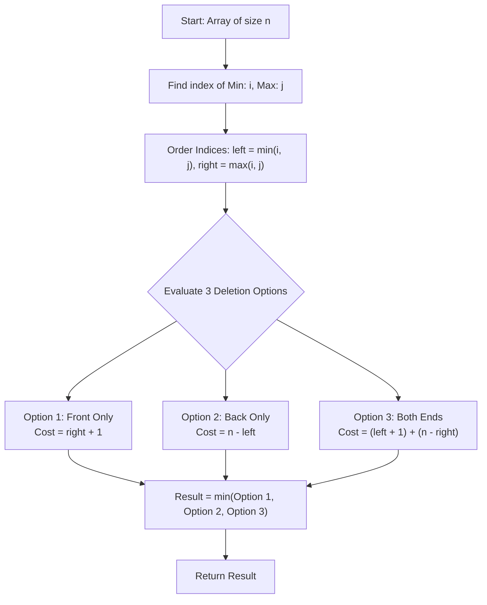

<h2><a href="https://leetcode.com/problems/removing-minimum-and-maximum-from-array">2091. Removing Minimum and Maximum From Array</a></h2>

<p>You are given a <strong>0-indexed</strong> array of <strong>distinct</strong> integers <code>nums</code>.</p>

<p>There is an element in <code>nums</code> that has the <strong>lowest</strong> value and an element that has the <strong>highest</strong> value. We call them the <strong>minimum</strong> and <strong>maximum</strong> respectively. Your goal is to remove <strong>both</strong> these elements from the array.</p>

<p>A <strong>deletion</strong> is defined as either removing an element from the <strong>front</strong> of the array or removing an element from the <strong>back</strong> of the array.</p>

<p>Return <em>the <strong>minimum</strong> number of deletions it would take to remove <strong>both</strong> the minimum and maximum element from the array.</em></p>

<p>&nbsp;</p>
<p><strong class="example">Example 1:</strong></p>

<pre><strong>Input:</strong> nums = [2,<u><strong>10</strong></u>,7,5,4,<u><strong>1</strong></u>,8,6]
<strong>Output:</strong> 5
<strong>Explanation:</strong> 
The minimum element in the array is nums[5], which is 1.
The maximum element in the array is nums[1], which is 10.
We can remove both the minimum and maximum by removing 2 elements from the front and 3 elements from the back.
This results in 2 + 3 = 5 deletions, which is the minimum number possible.
</pre>

<p><strong class="example">Example 2:</strong></p>

<pre><strong>Input:</strong> nums = [0,<u><strong>-4</strong></u>,<u><strong>19</strong></u>,1,8,-2,-3,5]
<strong>Output:</strong> 3
<strong>Explanation:</strong> 
The minimum element in the array is nums[1], which is -4.
The maximum element in the array is nums[2], which is 19.
We can remove both the minimum and maximum by removing 3 elements from the front.
This results in only 3 deletions, which is the minimum number possible.
</pre>

<p><strong class="example">Example 3:</strong></p>

<pre><strong>Input:</strong> nums = [<u><strong>101</strong></u>]
<strong>Output:</strong> 1
<strong>Explanation:</strong>  
There is only one element in the array, which makes it both the minimum and maximum element.
We can remove it with 1 deletion.
</pre>

<p>&nbsp;</p>
<p><strong>Constraints:</strong></p>

<ul>
	<li><code>1 &lt;= nums.length &lt;= 10<sup>5</sup></code></li>
	<li><code>-10<sup>5</sup> &lt;= nums[i] &lt;= 10<sup>5</sup></code></li>
	<li>The integers in <code>nums</code> are <strong>distinct</strong>.</li>
</ul>


---

# 🛍️ Removing-Minimum-and-Maximum-From-Array | Explained

## Approach 1: Single-Pass Extremum Tracking with Three-Way Boundary Evaluation

### Intuition
Imagine a row of books on a long shelf where you need to retrieve two specific books: the thinnest one (minimum) and the thickest one (maximum). You are only allowed to remove books from either the absolute left end or the absolute right end of the shelf. 

Because you can only clear items from the boundaries inward, there are only three possible strategies to remove both target books:
1. **Clear from the left only:** Remove all books from the left edge until you reach the target book that is located farther to the right.
2. **Clear from the right only:** Remove all books from the right edge until you reach the target book that is located farther to the left.
3. **Clear from both ends:** Remove books from the left edge to grab the closer target on the left, and remove books from the right edge to grab the closer target on the right.

By identifying the positions of both targets in a single scan, we can compute the cost of all three strategies and pick the one with the fewest deletions.

---

### Algorithm Visualized



#### Array Layout Representation:
```text
Index:   0       ...      left     ...     right     ...    n-1
         [==================|===============|================]
          <-- left + 1 ---->                 <-- n - right ->
          <------------ right + 1 --------->
                            <------------- n - left --------->
```

---

### Approach
1. **Find Extremum Indices:** Initialize `i = 0` (minimum index) and `j = 0` (maximum index). Iterate through the array `nums` of size `n`. If a smaller element than `nums[i]` is found, update `i`. If a larger element than `nums[j]` is found, update `j`.
2. **Normalize Spatial Positions:** Find which index is closer to the left boundary and which is closer to the right boundary:
   - `left = Math.min(i, j)`
   - `right = Math.max(i, j)`
3. **Calculate Costs for All Scenarios:**
   - **Scenario 1 (Remove both from the front):** Deleting from index `0` to `right` requires `right + 1` deletions.
   - **Scenario 2 (Remove both from the back):** Deleting from index `n - 1` down to `left` requires `n - left` deletions.
   - **Scenario 3 (Remove from both ends):** Deleting from index `0` to `left` takes `left + 1` deletions, and deleting from index `n - 1` down to `right` takes `n - right` deletions. Total = `(left + 1) + (n - right)`.
4. **Determine Minimum:** Return the minimum value among `removeFront`, `removeBack`, and `removeBoth`.

---

### Detailed Code Analysis

```java
class Solution {
    public int minimumDeletions(int[] nums) {
        int i=0;
        int j=0;
        int n= nums.length;
```
- **Lines 3–5:** We initialize pointer indices `i` (tracking the minimum element) and `j` (tracking the maximum element) to `0`. `n` stores the total number of elements in the array.

```java
        for(int l=0;l<n;l++)
        {
            if(nums[l]<nums[i])
            {
               i=l;
            }
            if(nums[l]>nums[j])
            {
                j=l;
            }
        }
```
- **Lines 6–16:** A single linear loop scans the array from index `0` to `n - 1`. 
  - If `nums[l] < nums[i]`, we update `i = l` because a new minimum has been found.
  - If `nums[l] > nums[j]`, we update `j = l` because a new maximum has been found.
  - Note: Since the problem guarantees distinct elements, `i` and `j` will uniquely identify the minimum and maximum elements.

```java
            int left=Math.min(i,j);
            int right=Math.max(i,j);
```
- **Lines 17–18:** We order the two indices geometrically along the array. `left` is the index that appears earlier in the array, and `right` is the index that appears later.

```java
            int removeFront=right+1;
            int removeBack=n-left;
            int removeBoth=(left+1)+(n-right);
            return Math.min(removeFront,Math.min(removeBack,removeBoth));
    }
}
```
- **Line 19 (`removeFront = right + 1`):** Deletes all elements from index `0` through `right`. Since `right > left`, this single continuous deletion from the left clears both the minimum and maximum elements.
- **Line 20 (`removeBack = n - left`):** Deletes all elements from index `n - 1` down to `left`. Since `left < right`, this single continuous deletion from the right clears both elements.
- **Line 21 (`removeBoth = (left + 1) + (n - right)`):** Deletes the `left + 1` prefix elements to clear the first target, and the `n - right` suffix elements to clear the second target.
- **Line 22:** Returns the smallest of these three options using nested `Math.min()` calls.

---

### Code

```java
class Solution {
    public int minimumDeletions(int[] nums) {
        int i = 0;
        int j = 0;
        int n = nums.length;
        
        for (int l = 0; l < n; l++) {
            if (nums[l] < nums[i]) {
                i = l;
            }
            if (nums[l] > nums[j]) {
                j = l;
            }
        }
        
        int left = Math.min(i, j);
        int right = Math.max(i, j);
        
        int removeFront = right + 1;
        int removeBack = n - left;
        int removeBoth = (left + 1) + (n - right);
        
        return Math.min(removeFront, Math.min(removeBack, removeBoth));
    }
}
```

---

### Complexity

- **Time Complexity:** $\mathcal{O}(n)$
  - We traverse the array of length $n$ exactly once to find the minimum and maximum elements.
  - The subsequent arithmetic operations and `Math.min` evaluations run in $\mathcal{O}(1)$ time.
  
- **Space Complexity:** $\mathcal{O}(1)$
  - Only a fixed number of integer variables (`i`, `j`, `n`, `left`, `right`, `removeFront`, `removeBack`, `removeBoth`) are allocated, requiring constant extra memory.

---

## 🕵️‍♂️ Follow-up Questions

### 1. What if the array contains duplicate minimum or maximum values?
If duplicates exist, we can select the occurrences that are closest to the boundaries to minimize deletion costs. 
- For the minimum, track both the first occurrence (closest to index `0`) and the last occurrence (closest to index `n - 1`).
- Do the same for the maximum.
- Test the combinations of optimal minimum and maximum positions to find the global minimum deletion count.

### 2. How would you generalize this to remove $K$ target elements instead of just 2?
If you need to remove $K$ arbitrary elements from the ends:
- Collect and sort all $K$ target indices in ascending order: $idx_0, idx_1, \dots, idx_{k-1}$.
- Any optimal strategy corresponds to removing a prefix of length $idx_p + 1$ (which covers targets $0 \dots p$) and a suffix of length $n - idx_{p+1}$ (which covers targets $p+1 \dots k-1$).
- Iterate through all split points $p \in [0, k-2]$ (along with the all-front and all-back cases) in $\mathcal{O}(K)$ time to find the minimum total deletions.