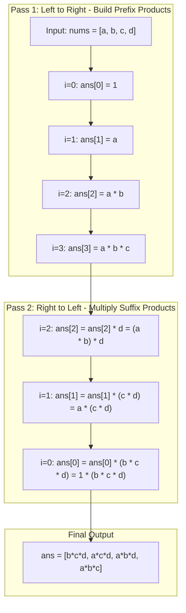

<h2><a href="https://leetcode.com/problems/product-of-array-except-self">238. Product of Array Except Self</a></h2>

<p>Given an integer array <code>nums</code>, return <em>an array</em> <code>answer</code> <em>such that</em> <code>answer[i]</code> <em>is equal to the product of all the elements of</em> <code>nums</code> <em>except</em> <code>nums[i]</code>.</p>

<p>The product of any prefix or suffix of <code>nums</code> is <strong>guaranteed</strong> to fit in a <strong>32-bit</strong> integer.</p>

<p>You must write an algorithm that runs in&nbsp;<code>O(n)</code>&nbsp;time and without using the division operation.</p>

<p>&nbsp;</p>
<p><strong class="example">Example 1:</strong></p>
<pre><strong>Input:</strong> nums = [1,2,3,4]
<strong>Output:</strong> [24,12,8,6]
</pre><p><strong class="example">Example 2:</strong></p>
<pre><strong>Input:</strong> nums = [-1,1,0,-3,3]
<strong>Output:</strong> [0,0,9,0,0]
</pre>
<p>&nbsp;</p>
<p><strong>Constraints:</strong></p>

<ul>
	<li><code>2 &lt;= nums.length &lt;= 10<sup>5</sup></code></li>
	<li><code>-30 &lt;= nums[i] &lt;= 30</code></li>
	<li>The input is generated such that <code>answer[i]</code> is <strong>guaranteed</strong> to fit in a <strong>32-bit</strong> integer.</li>
</ul>

<p>&nbsp;</p>
<p><strong>Follow up:</strong>&nbsp;Can you solve the problem in <code>O(1)</code>&nbsp;extra&nbsp;space complexity? (The output array <strong>does not</strong> count as extra space for space complexity analysis.)</p>


---

# 🛍️ Product-of-Array-Except-Self | Explained

## Approach 1: Two-Pass In-Place Prefix & Suffix Accumulation

### Intuition
Imagine a team of relay runners standing in a line where each runner needs to know the combined momentum of all other runners without including their own. Since you cannot use division to cancel out a runner's own momentum, you can split the problem into two perspectives:
1. Everything to the **left** of the runner (Prefix product).
2. Everything to the **right** of the runner (Suffix product).

By making one pass from left to right, we accumulate the running product of all previous numbers into the result array. Then, by making a second pass from right to left, we multiply those prefix products by the running product of all elements to the right. The result at any index $i$ is precisely $(\text{Prefix product before } i) \times (\text{Suffix product after } i)$.

### Algorithm Visualized



---

### Approach
1. **Initialize Output and State Trackers:**
   - Create an array `ans` of size $n$.
   - Maintain `pref = nums[0]` to track accumulated prefix multiplications.
   - Maintain `suf = nums[n-1]` to track accumulated suffix multiplications.
2. **Forward Pass (Prefix Accumulation):**
   - At index `0`, there are no left elements, so set `ans[0] = 1`.
   - At index `1`, only `nums[0]` is to the left, so set `ans[1] = nums[0]`.
   - For all indices `i >= 2`, update `pref = pref * nums[i-1]` to include the element immediately preceding $i$, and store `pref` in `ans[i]`.
3. **Backward Pass (Suffix Multiplication):**
   - Iterate backwards starting from index `n-2` down to `0`.
   - At index `n-2`, the suffix product is simply `nums[n-1]`. Multiply `ans[n-2]` by `nums[n+1]`.
   - For indices `i < n-2`, update `suf = suf * nums[i+1]` to include the element immediately to the right, then multiply `ans[i]` by `suf`.
   - Index `n-1` remains untouched during the backward pass because its suffix product is conceptually `1`.
4. **Return Result:** The output array `ans` now holds the total product except self for every index.

---

### Detailed Code Analysis

- **Lines 3–6:** 
  ```java
  int n = nums.length;
  int pref = nums[0];
  int suf = nums[n-1];
  int[] ans = new int[n];
  ```
  Extracts the length $n$, initializes `pref` with the first element and `suf` with the last element to seed the prefix/suffix running products, and allocates the result array `ans`.

- **Lines 7–18 (Prefix Loop):**
  ```java
  for(int i = 0; i < n; i++) {
      if (i == 0) ans[0] = 1;
      else if (i == 1) ans[1] = nums[0];
      else {
          pref = pref * nums[i-1];
          ans[i] = pref;
      }
  }
  ```
  - `i == 0`: Handles the base case where no elements exist to the left.
  - `i == 1`: Base case where only `nums[0]` exists to the left.
  - `i >= 2`: Multiplies `nums[i-1]` into `pref` before assigning to `ans[i]`. When $i=2$, `pref = nums[0] * nums[1]`, which correctly represents the product of elements before index $2$.

- **Lines 19–27 (Suffix Loop):**
  ```java
  for(int i = n - 2; i >= 0; i--) {
      if (i == n - 2) ans[i] = ans[i] * nums[i+1];
      else {
          suf = suf * nums[i+1];
          ans[i] = ans[i] * suf;
      }
  }
  ```
  - Starts at index `n - 2` because `ans[n-1]` already contains the complete prefix product of all elements prior to `n-1`.
  - `i == n - 2`: Multiplies `ans[n-2]` by `nums[n-1]`.
  - `i < n - 2`: Updates `suf` with `nums[i+1]` so `suf` becomes $\prod_{k=i+1}^{n-1} \text{nums}[k]$, and multiplies this directly into `ans[i]`.

- **Line 28:**
  ```java
  return ans;
  ```
  Returns the fully computed result array.

---

### Code

```java
class Solution {
    public int[] productExceptSelf(int[] nums) {
        int n = nums.length;
        int pref = nums[0];
        int suf = nums[n-1];
        int[] ans = new int[n];
        
        // Pass 1: Construct prefix products
        for (int i = 0; i < n; i++) {
            if (i == 0) {
                ans[0] = 1;
            } else if (i == 1) {
                ans[1] = nums[0];
            } else {
                pref = pref * nums[i - 1];
                ans[i] = pref;
            }
        }
        
        // Pass 2: Multiply by suffix products
        for (int i = n - 2; i >= 0; i--) {
            if (i == n - 2) {
                ans[i] = ans[i] * nums[i + 1];
            } else {
                suf = suf * nums[i + 1];
                ans[i] = ans[i] * suf;
            }
        }
        
        return ans;
    }
}
```

---

### Complexity

- **Time:** $\mathcal{O}(n)$
  - The first loop runs $n$ iterations to compute prefix products.
  - The second loop runs $n-1$ iterations to compute suffix products.
  - Overall time complexity is linear: $\mathcal{O}(n) + \mathcal{O}(n) = \mathcal{O}(n)$.

- **Space:** $\mathcal{O}(1)$ Auxiliary Space
  - The algorithm only uses a few primitive variables (`n`, `pref`, `suf`, `i`).
  - As per problem conventions, the output array `ans` is not counted toward the auxiliary space complexity.

---

## 🕵️‍♂️ Follow-up Questions

1. **How can you write this without the `if/else` edge-case branching for cleaner code?**
   - Instead of initializing `pref = nums[0]` and branching on $i=0$ and $i=1$, you can set a single running variable `prefix = 1`. In each iteration $i$, set `ans[i] = prefix`, then update `prefix *= nums[i]`. A similar pattern applies to the backward pass with `suffix = 1`.

2. **How does this solution handle arrays containing zeros?**
   - **One Zero:** The prefix/suffix logic naturally computes $0$ for all non-zero elements, and computes the non-zero product for the single zero element without triggering division-by-zero errors.
   - **Two or More Zeros:** Any product excluding one zero will still contain at least one other zero, making all entries in the final array $0$. The multiplication logic handles this implicitly.