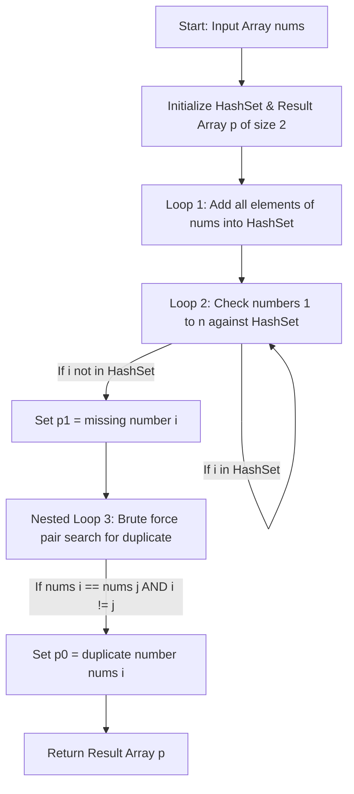

<h2><a href="https://leetcode.com/problems/set-mismatch">645. Set Mismatch</a></h2>

<p>You have a set of integers <code>s</code>, which originally contains all the numbers from <code>1</code> to <code>n</code>. Unfortunately, due to some error, one of the numbers in <code>s</code> got duplicated to another number in the set, which results in <strong>repetition of one</strong> number and <strong>loss of another</strong> number.</p>

<p>You are given an integer array <code>nums</code> representing the data status of this set after the error.</p>

<p>Find the number that occurs twice and the number that is missing and return <em>them in the form of an array</em>.</p>

<p>&nbsp;</p>
<p><strong class="example">Example 1:</strong></p>
<pre><strong>Input:</strong> nums = [1,2,2,4]
<strong>Output:</strong> [2,3]
</pre><p><strong class="example">Example 2:</strong></p>
<pre><strong>Input:</strong> nums = [1,1]
<strong>Output:</strong> [1,2]
</pre>
<p>&nbsp;</p>
<p><strong>Constraints:</strong></p>

<ul>
	<li><code>2 &lt;= nums.length &lt;= 10<sup>4</sup></code></li>
	<li><code>1 &lt;= nums[i] &lt;= 10<sup>4</sup></code></li>
</ul>


---

# 🛍️ Set-Mismatch | Explained

## Approach 1: Hybrid HashSet & Brute-Force Nested Loop Search
### Intuition
Imagine you are an event host checking a guest list of $N$ expected attendees numbered 1 through $N$. To find out who didn't show up, you put every ticket collected at the door into a bag (a Hash Set) and check off numbers 1 through $N$. If a number isn't in the bag, that guest is missing. To find out who snuck in twice (the duplicate), instead of using a frequency tracker, you compare every single ticket against every other ticket in a pile one by one until you find two tickets with the exact same number.

### Algorithm Visualized


### Approach
1. **Initialize Data Structures**: Create a `HashSet` to store unique elements present in `nums` and an integer array `p` of size 2 to hold `[duplicate, missing]`.
2. **Identify Missing Number ($O(N)$)**: 
   - Iterate through `nums` and insert every element into the `HashSet`.
   - Iterate from `1` to $n$. Check if each number exists in the `HashSet`. The number that is missing is assigned to `p[1]`.
3. **Identify Duplicate Number ($O(N^2)$)**:
   - Use two nested loops to check every pair of indices `(i, j)`.
   - If `nums[i] == nums[j]` and `i != j`, we have identified the duplicate number. Assign this value to `p[0]`.
4. **Return Result**: Return the array `p`.

### Detailed Code Analysis
- **Lines 3–5 (`int n = nums.length; HashSet<Integer> ans = new HashSet<>(); int[] p = new int[2];`)**:
  - `n` stores the total count of numbers.
  - `ans` is instantiated as a `HashSet` to enable $O(1)$ average time complexity for checking existence.
  - `p` is initialized to store two integer values: `p[0]` for duplicate and `p[1]` for missing.
- **Line 6 (`for(int i=0;i<n;i++) ans.add(nums[i]);`)**:
  - Iterates through the input array and inserts each value into `ans`. Duplicate values are automatically deduplicated by the set property.
- **Line 7 (`for(int i=1;i<=n;i++) if(!ans.contains(i)) p[1]=i;`)**:
  - Iterates through the expected range $[1, n]$.
  - Checks if the set contains $i$. Since $i$ missing from the set implies it was never in `nums`, `p[1]` is assigned $i$.
- **Lines 8–17 (`for(int i=0;i<n;i++) { for(int j=0;j<n;j++) { ... } }`)**:
  - A pairwise comparison approach. For every index `i`, loop through every index `j`.
  - Condition `nums[i] == nums[j] && i != j` checks if two distinct indices hold identical values. Once matched, `p[0]` receives the duplicate value `nums[i]`.
- **Line 18 (`return p;`)**:
  - Returns the final answer array containing `[duplicate, missing]`.

### Code
```java
class Solution {
    public int[] findErrorNums(int[] nums) {
        int n = nums.length;
        HashSet<Integer> ans = new HashSet<>();
        int[] p = new int[2];

        // Step 1: Add elements to HashSet
        for (int i = 0; i < n; i++) {
            ans.add(nums[i]);
        }

        // Step 2: Find missing element using HashSet
        for (int i = 1; i <= n; i++) {
            if (!ans.contains(i)) {
                p[1] = i;
            }
        }

        // Step 3: Find duplicate element using nested loops
        for (int i = 0; i < n; i++) {
            for (int j = 0; j < n; j++) {
                if (nums[i] == nums[j] && i != j) {
                    p[0] = nums[i];
                }
            }
        }

        return p;
    }
}
```

### Complexity
- **Time Complexity:** $\mathcal{O}(N^2)$
  - Adding elements to the `HashSet` takes $\mathcal{O}(N)$ time.
  - Looking up missing numbers in the range $[1, N]$ takes $\mathcal{O}(N)$ time.
  - The nested loops compare every element against every other element, resulting in $N \times N = N^2$ iterations, dominating the total runtime.
- **Space Complexity:** $\mathcal{O}(N)$
  - The `HashSet` stores up to $N - 1$ unique elements, requiring $\mathcal{O}(N)$ auxiliary space.

---

## 🕵️‍♂️ Follow-up Questions (Optional)

1. **How can you optimize this solution to run in $\mathcal{O}(N)$ time and $\mathcal{O}(1)$ auxiliary space?**
   - **Answer:** Use the array itself as a hash map (In-place Index Marking). Iterate through `nums`, for each number `x = Math.abs(nums[i])`, check the element at index `x - 1`. If it is already negative, `x` is the duplicate. Otherwise, negate `nums[x - 1]`. Afterwards, iterate through `nums` again; the index with a positive number indicates that `index + 1` is the missing value.

2. **Can this problem be solved using pure mathematics in $\mathcal{O}(N)$ time and $\mathcal{O}(1)$ space?**
   - **Answer:** Yes, using sum and sum of squares equations. 
     - Calculate expected sum $S_{exp} = \frac{N(N+1)}{2}$ and actual sum $S_{act}$. Their difference gives $D - M = S_{act} - S_{exp}$.
     - Calculate expected sum of squares $SQ_{exp} = \frac{N(N+1)(2N+1)}{6}$ and actual sum of squares $SQ_{act}$. Their difference gives $D^2 - M^2 = SQ_{act} - SQ_{exp}$.
     - Since $D^2 - M^2 = (D - M)(D + M)$, we can derive $D + M$, and solve the linear equations for duplicate ($D$) and missing ($M$).