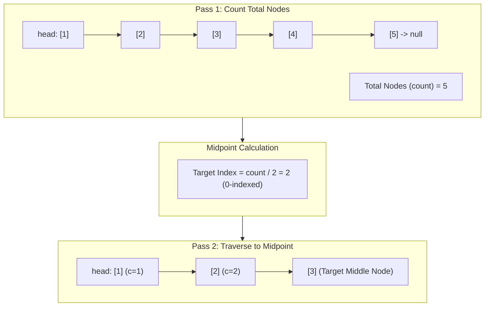

<h2><a href="https://leetcode.com/problems/middle-of-the-linked-list">876. Middle of the Linked List</a></h2>

<p>Given the <code>head</code> of a singly linked list, return <em>the middle node of the linked list</em>.</p>

<p>If there are two middle nodes, return <strong>the second middle</strong> node.</p>

<p>&nbsp;</p>
<p><strong class="example">Example 1:</strong></p>

<pre><strong>Input:</strong> head = [1,2,3,4,5]
<strong>Output:</strong> [3,4,5]
<strong>Explanation:</strong> The middle node of the list is node 3.
</pre>

<p><strong class="example">Example 2:</strong></p>

<pre><strong>Input:</strong> head = [1,2,3,4,5,6]
<strong>Output:</strong> [4,5,6]
<strong>Explanation:</strong> Since the list has two middle nodes with values 3 and 4, we return the second one.
</pre>

<p>&nbsp;</p>
<p><strong>Constraints:</strong></p>

<ul>
	<li>The number of nodes in the list is in the range <code>[1, 100]</code>.</li>
	<li><code>1 &lt;= Node.val &lt;= 100</code></li>
</ul>


---

# 🛍️ Middle-of-the-Linked-List | Explained

## Approach 1: Two-Pass Length Calculation (Count & Traverse)

### Intuition
Imagine walking a winding trail with no distance markers. To find the exact midpoint, you first walk the entire path from start to finish with a pedometer to record the total number of steps. Once you reach the end, you divide that step count by two. Finally, you walk back to the trailhead and advance exactly half that number of steps to land on the middle spot.

In a singly linked list, we do not have random access by index like an array. Therefore, the most direct approach is a two-pass algorithm:
1. **Pass 1:** Traverse the entire list to count the total number of nodes ($N$).
2. **Calculate:** Determine the index of the middle node.
3. **Pass 2:** Traverse from the `head` again, stopping at the computed midpoint index.

---

### Algorithm Visualized



---

### Approach
1. **Count the Nodes:** Initialize `count = 0` and a pointer `current = head`. Advance `current` through the linked list node-by-node, incrementing `count` at each step until reaching the end (`null`).
2. **Compute Midpoint Offset:** Compute how many steps from the head are required to reach the middle. For an even-length list (e.g., length $6$), LeetCode requires returning the second middle node (index $3$). Integer division `count / 2` maps directly to this offset.
3. **Traverse to Target:** Reset `current` to `head`. Using a loop counter (e.g., `c`), advance `current = current.next` until `c` matches the midpoint step count.
4. **Return Result:** Return `current`, which now points directly to the middle node.

---

### Detailed Code Analysis

Here is how the logic maps to the operations in your code:

- **Pass 1 (Counting):**
  ```java
  while (current != null) {
      count++;
      current = current.next;
  }
  ```
  `current` starts at `head` and walks through every node. Each iteration increments `count` by $1$ and moves `current` to `current.next`.

- **Midpoint Offset Computation:**
  ```java
  count = count / 2;
  ```
  Your code computes the number of transitions needed from `head`. For odd lengths (e.g., $5$), `5 / 2 = 2` transitions land on node $3$. For even lengths (e.g., $6$), `6 / 2 = 3` transitions land on the second middle node (node $4$).

- **Pass 2 (Advancement):**
  ```java
  current = head;
  while (c <= count) {
      c++;
      current = current.next;
  }
  ```
  `current` is reset back to `head`. The loop increments counter `c` while advancing `current = current.next` until the loop condition terminates, leaving `current` sitting on the required midpoint.

---

### Code

```java
/**
 * Definition for singly-linked list.
 * public class ListNode {
 *     int val;
 *     ListNode next;
 *     ListNode() {}
 *     ListNode(int val) { this.val = val; }
 *     ListNode(int val, ListNode next) { this.val = val; this.next = next; }
 * }
 */
class Solution {
    public ListNode middleNode(ListNode head) {
        int count = 0;
        ListNode current = head;

        // Pass 1: Count total nodes
        while (current != null) {
            count++;
            current = current.next;
        }

        // Calculate steps needed to reach the middle node
        count = count / 2;

        // Pass 2: Reset to head and step forward to the midpoint
        current = head;
        int c = 1;
        while (c <= count) {
            c++;
            current = current.next;
        }

        return current;
    }
}
```

---

### Complexity

- **Time Complexity:** $\mathcal{O}(N)$
  - First pass traverses all $N$ nodes to count the length: $N$ operations.
  - Second pass traverses $\lfloor N / 2 \rfloor$ nodes to reach the middle: $N / 2$ operations.
  - Total time: $\mathcal{O}(N + N/2) = \mathcal{O}(N)$, which is linear.

- **Space Complexity:** $\mathcal{O}(1)$
  - The solution uses only two integer counters (`count`, `c`) and a single auxiliary pointer (`current`).
  - No extra memory or auxiliary data structures are allocated.

---

## 🕵️‍♂️ Follow-up Questions

### 1. Can we solve this in a single pass instead of two passes?
**Answer:** Yes, using **Floyd's Tortoise and Hare (Fast & Slow Pointers)** approach. 
- Initialize `slow = head` and `fast = head`.
- Move `slow` by $1$ step (`slow = slow.next`) and `fast` by $2$ steps (`fast = fast.next.next`) simultaneously.
- When `fast` reaches the end (`fast == null || fast.next == null`), `slow` will naturally be at the middle node, cutting the number of pointer traversals in half.

### 2. How does the behavior change if we are asked for the *first* middle node instead of the *second* in an even-length list?
**Answer:** 
- In the two-pass approach: Change the target index calculation to `(count - 1) / 2`.
- In the fast/slow pointer approach: Change the loop termination condition to check `fast.next != null && fast.next.next != null`.